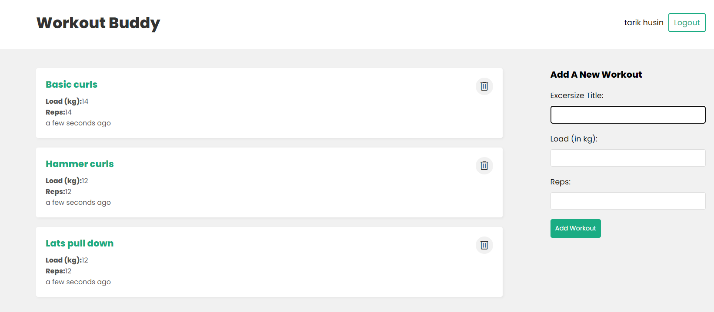
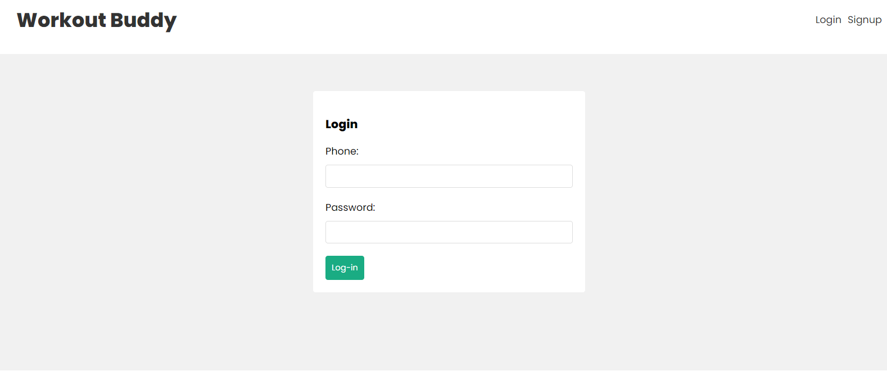

# React Workout's App

Simple React Workout's project.

 

 

 

# FEATURES

`FRONTEND`

- React Router 
- React Hooks
- Fetch data from outside api
- Custom React Hooks
- React Context
- Protected Routes 

`BACKEND`

- Nodejs API with EXPRESS
- json Web Token
- Bcrypt password hashing
- Protected backend routes
- Mongoose + MongoDB Atlas

